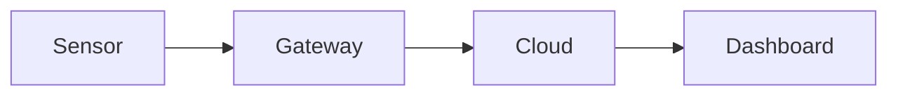

The grey boxes show what to type; the part below each one shows the result.
Pages are MDX: Markdown plus components. Everything above the
[Components](#components) section survives a save in the browser editor.

## Links {/* #links */}

Link to another page with its file name, and to a heading on it with the
heading in lower case with dashes:

```text
[Editing these docs](editing-these-docs.md)
[Images section](editing-these-docs.md#images)
```

[Editing these docs](editing-these-docs.md) ·
[Images section](editing-these-docs.md#images)

### Stable section links

A heading's link changes when its text changes. To keep links working
after a rename, give the heading a fixed ID at the end of the line:

```text
### Support hours {/* #support-hours */}
```

Then link to it with that ID, from this page or any other:
[support hours](#support-hours).

#### Support hours {/* #support-hours */}

Support is available Monday to Friday, 8:00 to 17:00.

:::note

For a link to a single paragraph, see [Components](#components). That needs an
HTML anchor, which the browser editor may remove.

:::

### Footnotes

```text
Exports are limited to 10,000 rows.[^limit]

[^limit]: Contact support for larger exports.
```

Exports are limited to 10,000 rows.[^limit]

[^limit]: Contact support for larger exports.

## Boxes

```text
:::note
Plain note. Also: tip, info, warning, danger.
:::

:::warning[Data loss]
A box with its own title.
:::
```

:::note

Plain note. Also: tip, info, warning, danger.

:::

:::warning[Data loss]

A box with its own title.

:::

Boxes can contain other boxes; give the outer one an extra colon:

```text
::::info[Before you start]
Check the following:

:::tip
You need admin rights.
:::
::::
```

::::info[Before you start]

Check the following:

:::tip

You need admin rights.

:::

::::

## Code

Code blocks get a copy button automatically. After the language you can
add a title, highlighted lines and line numbers:

```text
language: json title="sensor.json" {3} showLineNumbers
```

```json title="sensor.json" {3} showLineNumbers
{
  "name": "Warehouse 1",
  "interval": 60,
  "alerts": true
}
```

Shell commands use the language `bash` (or `powershell`):

```bash
curl -O https://example.com/agent.sh
sh agent.sh --token YOUR_TOKEN
```

## Images


## Diagrams

A code block with the language `mermaid` becomes a diagram:



## Tables

Use the editor's table button, or type one:

| Plan | Sensors | Support |
| --- | --- | --- |
| Basic | 10 | Email |
| Pro | 100 | Phone |

## Page settings

Maintainers can set more fields at the top of a page file, for example a
search-engine description (this page has one) or a shorter sidebar name:

```text
description: Syntax for these docs, with examples.
sidebar_label: Syntax
```

## Components {/* #components */}

These use MDX: HTML-like tags and components inside the page. They are stock
Docusaurus features, but the browser editor may remove them when it saves,
so pages that use them are best edited in a code editor.

### Keyboard keys

```mdx
Press <kbd>Ctrl</kbd>+<kbd>S</kbd> to save.
```

Press <kbd>Ctrl</kbd>+<kbd>S</kbd> to save.

### Collapsible section

```mdx
<details>
  <summary>Why is my sensor offline?</summary>

  Check the power supply first.
</details>
```

<details>
  <summary>Why is my sensor offline?</summary>

  Check the power supply first.
</details>

### Tabs

```mdx
import Tabs from '@theme/Tabs';
import TabItem from '@theme/TabItem';

<Tabs>
  <TabItem value="windows" label="Windows">Download the installer.</TabItem>
  <TabItem value="macos" label="macOS">Download the disk image.</TabItem>
</Tabs>
```

import Tabs from '@theme/Tabs';
import TabItem from '@theme/TabItem';

<Tabs>
  <TabItem value="windows" label="Windows">Download the installer.</TabItem>
  <TabItem value="macos" label="macOS">Download the disk image.</TabItem>
</Tabs>

### Variables

Define a value once at the top of a page and use it anywhere on it:

```mdx
export const product = 'Acme Monitor';

Welcome to {product}.
```

export const product = 'Acme Monitor';

Welcome to {product}.

### Linking to a paragraph

Put an anchor in front of the paragraph and link to it like a heading:

```mdx
import Link from '@docusaurus/Link';

<Link id="export-limit" />Exports are limited to 10,000 rows.

See the [export limit](#export-limit).
```

import Link from '@docusaurus/Link';

<Link id="export-limit" />Exports are limited to 10,000 rows.

See the [export limit](#export-limit).

## Things to avoid in text

In MDX some characters have a meaning, and a mistake stops the site from
updating until it is fixed:

- `{` starts code. Write `\{` for a literal brace.
- `<` directly followed by a letter or number starts a tag. Write `&lt;` or add a space (`< 10`).
- Use `{/* comment */}` for comments, not `<!-- -->`.
- Task lists (`- [ ]`) lose their checkboxes in the browser editor.
