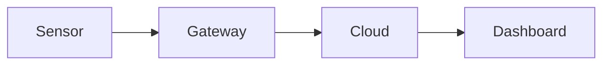

Everything on this page survives a save in the browser editor. The grey
boxes show what to type; the part below each one shows the result.

## Links {#links}

Link to another page with its file name, and to a heading on it with the
heading in lower case with dashes:

```text
[Editing these docs](editing-these-docs.md)
[Images section](editing-these-docs.md#images)
```

[Editing these docs](editing-these-docs.md) ·
[Images section](editing-these-docs.md#images)

### Stable section links

A heading's link changes when its text changes. To keep links working
after a rename, give the heading a fixed ID at the end of the line:

```text
### Support hours {#support-hours}
```

Then link to it with that ID, from this page or any other:
[support hours](#support-hours).

#### Support hours {#support-hours}

Support is available Monday to Friday, 8:00 to 17:00.

:::note

Links can only point to headings, not to individual paragraphs. A
paragraph anchor would need HTML, which the editor removes. Give the
paragraph a small heading instead, like the one above.

:::

### Footnotes

```text
Exports are limited to 10,000 rows.[^limit]

[^limit]: Contact support for larger exports.
```

Exports are limited to 10,000 rows.[^limit]

[^limit]: Contact support for larger exports.

## Boxes

```text
:::note
Plain note. Also: tip, info, warning, danger.
:::

:::warning[Data loss]
A box with its own title.
:::
```

:::note

Plain note. Also: tip, info, warning, danger.

:::

:::warning[Data loss]

A box with its own title.

:::

Boxes can contain other boxes; give the outer one an extra colon:

```text
::::info[Before you start]
Check the following:

:::tip
You need admin rights.
:::
::::
```

::::info[Before you start]

Check the following:

:::tip

You need admin rights.

:::

::::

## Code

Code blocks get a copy button automatically. After the language you can
add a title, highlighted lines and line numbers:

```text
language: bash title="install.sh" {2} showLineNumbers
```

```bash title="install.sh" {2} showLineNumbers
curl -O https://example.com/agent.sh
sh agent.sh --token YOUR_TOKEN
```

## Images


## Diagrams

A code block with the language `mermaid` becomes a diagram:



## Tables

Use the editor's table button, or type one:


| Plan | Sensors | Support |
| ----- | ------- | ------- |
| Basic | 10 | Email |
| Pro | 100 | Phone |


## Page settings

Maintainers can set more fields at the top of a page file, for example a
search-engine description (this page has one) or a shorter sidebar name:

```text
description: Syntax that survives the browser editor, with examples.
sidebar_label: Syntax
```

## What the browser editor can't keep

- Task lists (`- [ ]`) lose their checkboxes.
- Raw HTML is removed, so there are no collapsible sections, keyboard keys or paragraph anchors.
- Tabs and other components need MDX pages, which the editor can't edit safely.

