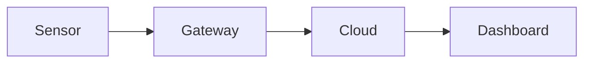

Die grauen Kästen zeigen, was du schreibst; darunter steht jeweils das Ergebnis.
Seiten sind MDX: Markdown plus Komponenten.

## Links

Verlinke eine andere Seite über ihren Dateinamen und eine Überschrift darauf
mit der Überschrift in Kleinbuchstaben mit Bindestrichen:

```text
[Diese Dokumentation bearbeiten](editing-these-docs.md)
[Abschnitt Bilder](editing-these-docs.md#bilder)
```

[Diese Dokumentation bearbeiten](editing-these-docs.md) ·
[Abschnitt Bilder](editing-these-docs.md#bilder)

### Stabile Abschnittslinks

Der Link einer Überschrift ändert sich, wenn sich ihr Text ändert. Damit Links
nach einer Umbenennung weiter funktionieren, gib der Überschrift am Zeilenende
eine feste ID:

```text
### Supportzeiten {/* #support-hours */}
```

Dann verlinkst du sie über diese ID, von dieser oder jeder anderen Seite.

:::danger[Nicht in Sveltia]

Sveltia macht beim Speichern aus `/*` ein `/\*`. Das zerstört die feste ID und
verhindert, dass die Website aktualisiert wird. Füge feste IDs nur in einem
Code-Editor ein. Überschriften bekommen trotzdem automatisch eine ID aus ihrem
Text, deshalb ist diese hier auch ohne verlinkbar:
[Supportzeiten](#supportzeiten).

:::

#### Supportzeiten

Der Support ist Montag bis Freitag von 8:00 bis 17:00 Uhr erreichbar. Für einen
Link auf einen einzelnen Absatz siehe [Komponenten](#komponenten).

### Fußnoten

```text
Exporte sind auf 10.000 Zeilen begrenzt.[^limit]

[^limit]: Für größere Exporte wende dich an den Support.
```

Exporte sind auf 10.000 Zeilen begrenzt.[^limit]

[^limit]: Für größere Exporte wende dich an den Support.

## Kästen

```text
:::note
Einfacher Hinweis. Außerdem: tip, info, warning, danger.
:::

:::warning[Datenverlust]
Ein Kasten mit eigenem Titel.
:::
```

:::note

Einfacher Hinweis. Außerdem: tip, info, warning, danger.

:::

:::warning[Datenverlust]

Ein Kasten mit eigenem Titel.

:::

Kästen können andere Kästen enthalten; der äußere bekommt einen Doppelpunkt mehr:

```text
::::info[Bevor du anfängst]
Prüfe Folgendes:

:::tip
Du brauchst Administratorrechte.
:::
::::
```

::::info[Bevor du anfängst]

Prüfe Folgendes:

:::tip

Du brauchst Administratorrechte.

:::

::::

## Code

Codeblöcke bekommen automatisch eine Kopieren-Schaltfläche. Nach der Sprache
kannst du einen Titel, hervorgehobene Zeilen und Zeilennummern angeben:

```text
language: json title="sensor.json" {3} showLineNumbers
```

```json title="sensor.json" {3} showLineNumbers
{
  "name": "Lager 1",
  "interval": 60,
  "alerts": true
}
```

Befehle für die Kommandozeile verwenden die Sprache `bash` (oder `powershell`):

```bash
curl -O https://example.com/agent.sh
sh agent.sh --token YOUR_TOKEN
```

## Bilder


## Diagramme

Ein Codeblock mit der Sprache `mermaid` wird zu einem Diagramm:



## Tabellen

Nutze die Tabellen-Schaltfläche des Editors oder schreibe eine:

| Tarif | Sensoren | Support |
| --- | --- | --- |
| Basic | 10 | E-Mail |
| Pro | 100 | Telefon |

## Seiteneinstellungen

Wer die Dokumentation betreut, kann oben in einer Seitendatei weitere Felder
setzen, zum Beispiel eine Beschreibung für Suchmaschinen (diese Seite hat eine)
oder einen kürzeren Namen für die Seitenleiste:

```text
description: Syntax für diese Dokumentation, mit Beispielen.
sidebar_label: Syntax
```

## Komponenten

Diese nutzen MDX: HTML-ähnliche Tags und Komponenten in der Seite. Es sind
Standardfunktionen von Docusaurus, aber der Browser-Editor entfernt sie
möglicherweise beim Speichern. Seiten damit bearbeitest du am besten in einem
Code-Editor.

### Tasten

```mdx
Drücke <kbd>Strg</kbd>+<kbd>S</kbd> zum Speichern.
```

Drücke <kbd>Strg</kbd>+<kbd>S</kbd> zum Speichern.

### Aufklappbarer Abschnitt

```mdx
<details>
  <summary>Warum ist mein Sensor offline?</summary>

  Prüfe zuerst die Stromversorgung.
</details>
```

<details>
  <summary>Warum ist mein Sensor offline?</summary>

  Prüfe zuerst die Stromversorgung.
</details>

### Tabs

```mdx
import Tabs from '@theme/Tabs';
import TabItem from '@theme/TabItem';

<Tabs>
  <TabItem value="windows" label="Windows">Lade das Installationsprogramm herunter.</TabItem>
  <TabItem value="macos" label="macOS">Lade das Disk-Image herunter.</TabItem>
</Tabs>
```

import Tabs from '@theme/Tabs';
import TabItem from '@theme/TabItem';

<Tabs>
  <TabItem value="windows" label="Windows">Lade das Installationsprogramm herunter.</TabItem>
  <TabItem value="macos" label="macOS">Lade das Disk-Image herunter.</TabItem>
</Tabs>

### Variablen

Lege einen Wert einmal oben auf einer Seite fest und verwende ihn überall darauf:

```mdx
export const product = 'Acme Monitor';

Willkommen bei {product}.
```

export const product = 'Acme Monitor';

Willkommen bei {product}.

### Auf einen Absatz verlinken

Setze einen Anker vor den Absatz und verlinke ihn wie eine Überschrift:

```mdx
import Link from '@docusaurus/Link';

<Link id="export-limit" />Exporte sind auf 10.000 Zeilen begrenzt.

Siehe das [Exportlimit](#export-limit).
```

import Link from '@docusaurus/Link';

<Link id="export-limit" />Exporte sind auf 10.000 Zeilen begrenzt.

Siehe das [Exportlimit](#export-limit).

## Was du im Text vermeiden solltest

In MDX haben manche Zeichen eine Bedeutung, und ein Fehler verhindert, dass die
Website aktualisiert wird, bis er behoben ist:

- `{` beginnt Code. Schreibe `\{` für eine geschweifte Klammer.
- `<` direkt vor einem Buchstaben oder einer Zahl beginnt ein Tag. Schreibe `&lt;` oder setze ein Leerzeichen (`< 10`).
- Kommentare schreibst du als `{/* Kommentar */}`, nicht als `<!-- -->`, und nur in einem Code-Editor: Sveltia macht sie kaputt.
- Aufgabenlisten (`- [ ]`) verlieren im Browser-Editor ihre Kästchen.

## Meine Änderung

Ich habe hier eine kleine Änderung gemacht!
